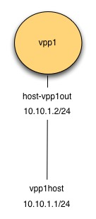

<div align=center>
	 
</div>

<br/>
<br/>
<br/>

<center><font size='20'>FD.io VPP：用户文档</font></center>
<br/>
<br/>
<center><font size='5'>荣涛</font></center>
<center><font size='5'>2020年9月</font></center>
<br/>
<br/>
<br/>
<br/>


# 1. 创建一个接口

[创建一个接口](https://fd.io/docs/vpp/master/gettingstarted/progressivevpp/interface.html)

<br/>

## 1.1. 要学习的技能

* 在Linux主机中创建veth接口
* 在Linux主机中的第veth个接口的一端分配IP地址
* 创建一个通过AF_PACKET连接到veth接口一端的vpp主机接口
* 将IP地址添加到vpp接口

<br/>

## 1.2. 在本练习中学习的VPP命令

* 创建主机接口
* 设置int状态
* 设置内部IP地址
* 显示硬件
* 显示诠释
* 显示int地址
* 跟踪添加
* 清除痕迹
* ping
* 显示ip arp
* 显示IP FIB

<br/>

## 1.3. 拓扑结构

<br/>

**注意：我们的环境是DPDK+VPP，在物理机中部署，使用真实Intel 10G网卡，所以我们不需要做本章节中由物理网卡虚拟出虚拟网卡的步骤。**

<br/>

网卡型号如下：

```bash
lspci | grep 10G
3b:00.0 Ethernet controller: Intel Corporation Ethernet 10G 2P X520 Adapter (rev 01)
3b:00.1 Ethernet controller: Intel Corporation Ethernet 10G 2P X520 Adapter (rev 01)
```



<br/>

## 1.4. 初始状态
在本教程的前面各节中，假定此处的初始状态为最终状态。

<br/>

## 1.5. 在主机上创建veth接口
在Linux中，有一种类型的接口称为“ veth”。将“ veth”接口视为具有两端（而不是一端）的接口。

创建一个veth接口，一端名为vpp1out，另一端名为vpp1host

```bash
$ sudo ip link add name vpp1out type veth peer name vpp1host
```

**UP网口：**

```bash
$ sudo ip link set dev vpp1out up
$ sudo ip link set dev vpp1host up
```

**分配IP地址**

```bash
$ sudo ip addr add 10.10.1.1/24 dev vpp1host
```

显示结果：

```bash
$ ip addr show vpp1host
5: vpp1host@vpp1out: <BROADCAST,MULTICAST,UP,LOWER_UP> mtu 1500 qdisc noqueue state UP group default qlen 1000
  link/ether e2:0f:1e:59:ec:f7 brd ff:ff:ff:ff:ff:ff
  inet 10.10.1.1/24 scope global vpp1host
     valid_lft forever preferred_lft forever
  inet6 fe80::e00f:1eff:fe59:ecf7/64 scope link
     valid_lft forever preferred_lft forever
```

<br/>

## 1.6. 创建vpp主机接口

确保VPP正在运行（如果未启动）。

```
$ ps -eaf | grep vpp
vagrant   2141   903  0 05:28 pts/0    00:00:00 grep --color=auto vpp
# 4. vpp is not running, so start it
$ sudo /usr/bin/vpp -c startup1.conf
```

这些命令从vpp shell运行。使用以下命令输入VPP Shell：

```
$ sudo vppctl -s /run/vpp/cli-vpp1.sock
    _______    _        _   _____  ___
 __/ __/ _ \  (_)__    | | / / _ \/ _ \
 _/ _// // / / / _ \   | |/ / ___/ ___/
 /_/ /____(_)_/\___/   |___/_/  /_/

vpp#
```

创建附加到vpp1out的主机接口。

```
vpp# create host-interface name vpp1out
host-vpp1out
```

确认接口：

```
vpp# show hardware
              Name                Idx   Link  Hardware
host-vpp1out                       1     up   host-vpp1out
Ethernet address 02:fe:d9:75:d5:b4
Linux PACKET socket interface
local0                             0    down  local0
local
```

打开接口：

```
vpp# set int state host-vpp1out up
```

确认接口已启动：

```
vpp# show int
              Name               Idx    State  MTU (L3/IP4/IP6/MPLS)     Counter          Count
host-vpp1out                      1      up          9000/0/0/0
local0                            0     down          0/0/0/0
```

分配IP地址10.10.1.2/24

```
vpp# set int ip address host-vpp1out 10.10.1.2/24
```

确认已分配IP地址：

```
vpp# show int addr
host-vpp1out (up):
  L3 10.10.1.2/24
local0 (dn):
```

<br/>

<br/>
<div align=right>	以上内容由荣涛翻译整理自网络。</div>