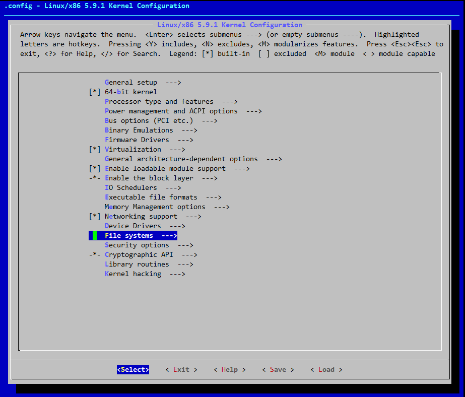

<div align=center>
	 
</div>

<center><font size='20'>Linux笔记 Linux内核的安装.md</font></center>
<br/>
<br/>
<center><font size='5'>RToax</font></center>
<center><font size='5'>2020年10月</font></center>
<br/>


# 1. 准备工作

## 1.1. 下载
[The Linux Kernel Archives](https://www.kernel.org/)
[Index of /pub/linux/kernel/](https://mirrors.edge.kernel.org/pub/linux/kernel/)

我下载的版本为：[linux-5.9.1.tar.xz](https://cdn.kernel.org/pub/linux/kernel/v5.x/linux-5.9.1.tar.xz)

## 1.2. 解压

```bash
tar -xf linux-5.9.1.tar.xz
```
解压后的大小为：
```bash
du -sh linux-5.9.1/
1.1G	linux-5.9.1/
```

## 1.3. 移动

```bash
mv linux-5.9.1 /usr/src/kernels/
```

## 1.4. 复制配置文件

```bash
cp -v /boot/config-$(uname -r) .config
"/boot/config-3.10.0-1062.el7.x86_64" -> ".config"
```

## 1.5. 安装依赖

```bash
yum install build-essential libncurses-dev bison flex libssl-dev libelf-dev
```
或者
```bash
yum group install "Development Tools"
```

安装
```bash
yum install ncurses-devel bison flex elfutils-libelf-devel openssl-devel
```

## 1.6. 更新GCC

需要更新较新的GCC编译器，否则会报错如下：
```
  CC       /usr/src/kernels/linux-5.9.1/tools/objtool/librbtree.o
  CC      scripts/mod/empty.o
In file included from ././include/linux/compiler_types.h:74:0,
                 from <命令行>:0:
./include/linux/compiler-gcc.h:15:3: 错误：#error Sorry, your compiler is too old - please upgrade it.
 # error Sorry, your compiler is too old - please upgrade it.
   ^
make[2]: *** [scripts/mod/empty.o] 错误 1
make[1]: *** [prepare0] 错误 2
make[1]: *** 正在等待未完成的任务....
  LD       /usr/src/kernels/linux-5.9.1/tools/objtool/objtool-in.o
  LINK     /usr/src/kernels/linux-5.9.1/tools/objtool/objtool

```
创建缓存
```bash
yum makecache
```
列出可安装的工具组
```bash
yum grouplist
```
安装对应的工具组
```bash
yum groupinstall "Development Tools"
```
安装高版本的gcc编译器
安装 `CentOS SCLo RH` 仓库:
```bash
yum install centos-release-scl-rh
```
安装 `devtoolset-9-gcc` rpm 包:
```bash
yum install devtoolset-9-gcc
```
使`devtoolset-9`生效
```bash
scl enable devtoolset-9 bash
```

```bash
gcc --version
```

## 1.7. 配置内核

```bash
make menuconfig
```



# 2. 编译内核

```bash
make
```
或者
```bash
## use 4 core/thread ##
$ make -j 4
## get thread or cpu core count using nproc command ##
$ make -j $(nproc)
```
进入漫长的编译过程
```
...
 CC [M]  drivers/pci/hotplug/acpiphp_ibm.o
  CC [M]  sound/core/isadma.o
  AR      drivers/pci/hotplug/built-in.a
  AR      drivers/pci/controller/dwc/built-in.a
  CC      kernel/crash_dump.o
  CC [M]  sound/core/sound_oss.o
  AR      drivers/pci/controller/mobiveil/built-in.a
  CC      drivers/pci/controller/vmd.o
...
  CC [M]  fs/nfs/super.o
  CC      drivers/pci/probe.o
  CC [M]  sound/core/pcm.o
...
```

# 3. 安装内核

## 3.1. 安装内核模块

```bash
sudo make modules_install
```

我在安装过程中遇到存储不足的情况，用下面命令查看并清理对应文件
```bash
du -h -x --max-depth=1
```

## 3.2. 安装内核
```bash
make install
```
这会安装三个后续grub会用到的文件

* initramfs-5.9.1.img
* System.map-5.9.1
* /boot/vmlinuz-5.9.1


# 4. 更新grub配置

如果是`CentOS/RHEL/Oracle/Scientific and Fedora` Linux
```bash
$ sudo grub2-mkconfig -o /boot/grub2/grub.cfg
$ sudo grubby --set-default /boot/vmlinuz-5.9.1   #安装自己定义的名称来设置
```

如果是`Debian/Ubuntu` Linux

```bash
$ sudo update-initramfs -c -k 5.9.1
$ sudo update-grub
```

可以用下面的命令确认是否执行成功：
```bash
grubby --info=ALL | more
grubby --default-index
grubby --default-kernel
```

# 5. 重启

```bash
reboot
```
进入系统后：
```bash
uname -mrs
```

```
Linux 5.9.1 x86_64
```


# 6. 参考文章

《[How to compile and install Linux Kernel 5.1.2 from source code](https://www.cnblogs.com/qccz123456/p/11009502.html#:~:text=The%20procedure%20to%20build%20%28compile%29%20and%20install%20the,7%20Update%20Grub%20configuration%208%20Reboot%20the%20system)》


<br/>
<div align=right>以上内容由RTOAX翻译整理自网络。
	 
</div>