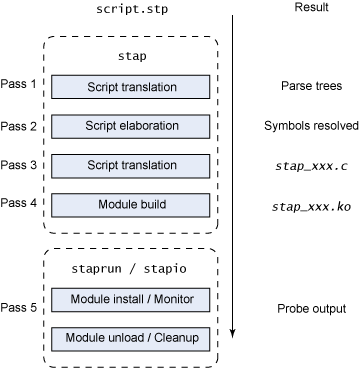
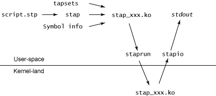

<div align=center>
	 
</div>
<br/>
<br/>

<center><font size='20'>SystemTap指令</font></center>
<br/>
<br/>
<center><font size='5'>RToax</font></center>
<center><font size='5'>2020年10月</font></center>
<br/>
<br/>
<br/>
<br/>

[SystemTap](https://access.redhat.com/documentation/en-us/red_hat_enterprise_linux/6/html/systemtap_beginners_guide/introduction)
[Linux introspection and SystemTap](https://www.ibm.com/developerworks/library/l-systemtap/index.html)
[Linux内核IO追踪：用GDB调试，一个磁盘IO的流程是什么样的](https://rtoax.blog.csdn.net/article/details/108901912)

# 1. 简介
`SystemTap`是一种跟踪和探测工具，它使用户可以详细研究和监视操作系统（`特别是内核`）的活动。它提供了类似的工具的输出信息，如`netstat，ps，top，和iostat`; 但是，SystemTap旨在为收集的信息提供更多的筛选和分析选项。
`SystemTap`是监视和跟踪正在运行的Linux内核的运行的动态方法。关键字是动态的，因为SystemTap允许您在运行时动态安装该工具，而不是使用工具构建特殊的内核。它使用称为Kprobes的应用程序编程接口（API） 进行此操作，本文将对此进行探讨。让我们开始探索一些较早的内核跟踪方法，然后深入研究SystemTap体系结构及其使用。

## 1.1. 文档目标
SystemTap提供了**监视正在运行的Linux系统以进行详细分析的基础结构**。这可以帮助管理员和开发人员确定错误或性能问题的根本原因。
如果没有SystemTap，则监视运行中的内核的活动将需要繁琐的工具，重新编译，安装和重新引导序列。SystemTap旨在消除这种情况，允许用户仅运行用户编写的SystemTap脚本即可收集相同的信息。
但是，SystemTap最初是为具有中高级内核知识的用户设计的。这使得SystemTap对于对Linux内核了解有限和经验有限的管理员或开发人员没有太大用处。此外，许多现有的SystemTap文档都类似地面向知识渊博的用户。这使得学习该工具同样困难。
为了降低这些障碍，SystemTap初学者指南的编写目标如下：

* 为了向用户介绍SystemTap，使他们熟悉其体系结构，并提供所有内核类型的设置说明。
* 提供预写的SystemTap脚本以监视系统不同组件中的详细活动，以及有关如何运行它们和分析其输出的说明。

## 1.2. SYSTEMTAP功能

* **灵活性**：SystemTap的框架允许用户开发简单的脚本，以调查和监视各种内核功能，系统调用以及内核空间中发生的其他事件。有了它，SystemTap不再是一个工具，而是使您可以开发自己的特定于内核的取证和监视工具的系统。
* **易于使用**：如前所述，SystemTap允许用户探查内核空间事件，而不必求助于冗长的工具，重新编译，安装和重新启动内核进程。

大多数所列举的了SystemTap脚本的第4章，有用的SystemTap脚本演示系统和取证本身不提供与其他类似的工具监视功能（如`top`，`oprofile`或`ps`）。提供这些脚本是为了向读者提供有关SystemTap应用程序的大量示例，这些示例进而将使他们进一步了解他们在编写自己的SystemTap脚本时可以使用的功能。

## 1.3. 内核跟踪

SystemTap与称为`DTrace`的较旧技术类似，该技术起源于`Sun Solaris`操作系统。在DTrace中，开发人员可以使用D编程语言（ C语言，但经过修改以支持特定于跟踪的行为）。DTrace脚本包含许多探针以及在探针“触发”时发生的关联操作。例如，探针可以表示诸如调用系统调用之类的简单操作，或者表示诸如正在执行的特定代码行之类的更复杂的交互操作。清单1显示了一个DTrace脚本的简单示例，该脚本计算每个进程进行的系统调用次数。（请注意使用字典将计数与进程关联）。脚本的格式包括探针（在进行系统调用时将触发）和操作（相应的操作脚本）。

清单1.一个简单的DTrace脚本来统计每个进程的系统调用

```
syscall:::entry 
{ 
 
  @num[pid,execname] = count(); 
 
}
```

`DTrace`是Solaris令人羡慕的一部分，因此发现它也是为其他操作系统开发的也就不足为奇了。DTrace是根据通用开发和发行许可证（`CDDL`）发布的，并已移植到`FreeBSD`操作系统中。

IBM为IBM®AIX®操作系统6.1版开发了另一种有用的内核跟踪工具，称为`ProbeVue`。您可以使用ProbeVue探索系统的行为和性能，并提供有关特定过程的详细信息。该工具使用标准内核以动态方式执行此操作。清单2显示了ProbeVue的示例脚本，该脚本指示正在调用sync系统调用的特定进程。

清单2.一个简单的ProbeVue脚本，指示您的哪些进程调用了sync
```
@@syscall:*:sync:entry
{
  printf( "sync() syscall invoked by process ID %d\n", __pid );
  exit();
}
```
考虑到DTrace和ProbeVue在各自的操作系统上的有用性，Linux的开源项目是不可避免的。SystemTap始于2005年，提供与**DTrace**和**ProbeVue**类似的功能。它由包括Red Hat，Intel，Hitachi和IBM等在内的社区开发。

这些解决方案中的每一个都提供相似的功能，并在触发探针时使用探针和关联的动作脚本。现在，让我们看一下SystemTap的安装，然后探索其架构和使用。


# 2. 安装SystemTap

根据您的发行版和内核，您可能仅通过安装SystemTap来支持SystemTap。在其他情况下，则需要调试内核映像。本节介绍了在**Ubuntu 8.10（Intrepid Ibex）**版本上安装SystemTap的过程，该版本不代表SystemTap的安装。在“相关主题”部分中，您将找到有关其他发行版和版本的安装的更多信息。

对于大多数用户而言，只需简单安装SystemTap。对于Ubuntu，请使用apt-get：

```bash
$ sudo apt-get install systemtap
```

安装完成后，您可以测试内核以查看其是否支持SystemTap。以下简单的命令行脚本可以实现该目标：

```bash
$ sudo stap -ve 'probe begin { log("hello world") exit() }'
```
如果此脚本有效，您将在标准输出[stdout]上看到“ hello world”。如果没有，抱歉，您还有其他工作要做。对于Ubuntu 8.10，需要调试内核映像。应该可以简单地使用apt-get来检索软件包 linux-image-debug-generic。但是由于无法直接完成**apt-get**，因此您可以下载并通过进行安装dpkg。您可以下载通用调试映像并按如下所示进行安装：
```
$ wget http://ddebs.ubuntu.com/pool/main/l/linux/
          linux-image-debug-2.6.27-14-generic_2.6.27-14.39_i386.ddeb
$ sudo dpkg -i linux-image-debug-2.6.27-14-generic_2.6.27-14.39_i386.ddeb
```

现在，您已经安装了通用调试映像。对于Ubuntu 8.10，只需要再迈出一步：通过修改SystemTap源代码，可以轻松解决SystemTap发行版的问题。请查看 相关信息，了解如何更新运行时time.c文件信息。

如果你有一个定制的内核，则需要确保内核选项CONFIG_RELAY， CONFIG_DEBUG_FS， CONFIG_DEBUG_INFO，和 CONFIG_KPROBES被启用。

# 3. SystemTap体系结构
让我们深入研究SystemTap的一些细节，以了解它如何在运行的内核中提供动态探针。您还将看到SystemTap的工作原理，从脚本编写过程到在运行中的内核中激活这些脚本。

## 3.1. 动态检测内核
SystemTap中用于检测运行中的内核的两种方法是 Kprobes和返回探针。但是了解任何内核的重要元素是内核映射，它提供符号信息（例如函数和变量以及它们的地址）。有了地图，您可以解析任何符号的地址并进行更改以支持探测行为。

从2.6.9版开始，**Kprobes**便已进入主线Linux内核，并提供用于探测内核的常规服务。它提供了一些不同的服务，但是最重要的两个是Kprobe和Kretprobe。Kprobe是特定于体系结构的，并在要探测的指令的第一个字节处插入一个断点指令。命中指令后，将执行探针的特定处理程序。完成后，将执行原始指令（从断点开始），然后在该点继续执行。

Kretprobes有所不同，它在被调用函数的返回上进行操作。请注意，由于函数可能有许多返回点，因此听起来有点复杂。但是，它实际上使用了一种称为蹦床的简单技术。您可以在函数条目中添加少量代码，而不是检测函数中的每个返回点（不能捕获所有情况）。此代码用蹦床地址（Kretprobe地址）替换堆栈上的返回地址。该函数存在时，它不会调用返回到调用者，而是调用Kretprobe，后者执行其功能，然后从Kretprobe返回到实际的调用者。

## 3.2. SystemTap流程
图1展示了SystemTap流程的基本流程，涉及五个阶段的三个交互实用程序。该过程从SystemTap脚本开始。您可以使用该stap实用程序将stap脚本转换为提供探测行为的内核模块。装订过程始于将脚本转换为解析树（第1遍）。然后，在详细步骤中（步骤2），使用有关当前正在运行的内核的符号信息来解析符号。然后，转换过程将解析树转换为 C源代码（第3遍），并使用已解析的信息以及所谓的tapset脚本（SystemTap定义的有用功能的库）。步骤的最后一步是构建内核模块（第4遍），该过程使用本地内核模块构建过程。

图1. SystemTap流程


利用内核模块的可用性，可以将stap 控制权移交给其他两个SystemTap实用程序： `staprun`和`stapio`。这两个实用程序协同工作，以管理将模块安装到内核中并将其输出路由到stdout（第5遍）。如果在外壳程序中按Ctrl-C或脚本退出，则将执行清理过程，该过程将卸载模块并导致所有关联的实用程序退出。

SystemTap的一项有趣功能是可以缓存脚本翻译。如果要安装脚本且未更改脚本，则可以使用现有模块，而无需执行重建过程。图2显示了用户空间和内核空间元素以及基于stap的翻译过程。

图2.从内核/用户空间角度看的SystemTap流程


# 4. SystemTap脚本
SystemTap中的脚本编写非常简单，但是也很灵活，有很多选项可以满足您的需要。“相关主题” 部分提供了指向手册的链接，这些手册详细介绍了语言和功能，但本部分将探索一些示例以使您对SystemTap脚本有所了解。

## 4.1. 探针
SystemTap脚本由探测器和激发探测器时要执行的相关代码块组成。探针具有许多已定义的模式，如表1所示。该表枚举了几种探针类型，包括调用内核函数和从内核函数返回。

表1.探针模式示例
|   探头类型  |   描述  |
| --- | --- |
|   begin  |   脚本开始时触发  |
|  end   |   脚本结束时触发  |
|   kernel.function("sys_sync")   |  在sys_sync被调用时触发   |
|  kernel.function("sys_sync").call   |   在sys_sync被调用时触发  |
|   kernel.function("sys_sync").return  |   sys_sync返回时触发  |
|  kernel.syscall.*   |  进行任何系统调用时触发   |
|  kernel.function("*@kernel/fork.c:934")    |  当fork.c的第934行被击中时触发   |
|   module("ext3").function("ext3_file_write")  |   write调用ext3函数时触发  |
|  timer.jiffies(1000)   |   每1000个内核抖动触发一次  |
|  timer.ms(200).randomize(50)   |  每200ms发射一次，使用线性分布的随机添加剂（-50至+50）   |


让我们看一个简单的示例，以了解如何构造探针并将代码与该探针关联。清单3中显示了一个示例探针，该探针在sys_sync调用内核系统调用时将触发 。触发该探针时，您要计算调用次数并发出此计数以及指示呼叫进程ID（PID）的信息。首先，声明任何探针都可以使用的全局值（全局名称空间是所有探针所共有的），然后将其初始化为零。接下来，定义您的探针，它是内核函数的入门探针sys_sync。与探针关联的脚本是增加 count变量，然后发出一条消息，该消息定义了进行调用的次数以及当前调用的PID。请注意，此示例看起来很像 C（探针定义语法除外），如果您有在中的背景，那就C很好了。

清单3.一个简单的探针和脚本
```
global count=0
 
probe kernel.function("sys_sync") {
  count++
  printf( "sys_sync called %d times, currently by pid %d\n", count, pid );
}
```
您还可以声明探针可以调用的函数，这对于要为其提供多个探针的常用函数来说是完美的。该工具甚至支持递归到给定的深度。

## 4.2. 变量和类型
SystemTap允许定义多种类型的变量，但是类型是从上下文推断出来的，因此不需要类型声明。在SystemTap中，您将找到**数字**（64位带符号整数），**整数**（64位数量），**字符串**和**文字**（字符串或整数）。您还可以使用关联数组和统计信息（我们将在后面进行探讨）。

## 4.3. 表达方式
SystemTap提供了所有您期望的必要运算符， C并且遵循相同的规则。您会发现算术运算符，二进制运算符，赋值运算符和指针解引用。您还会从中找到一些简化 C，包括字符串串联，关联数组元素和聚合运算符。

## 4.4. 语言要素
在一次探查中，SystemTap提供了一组让人联想起的舒适语句C。请注意，尽管该语言允许您开发复杂的脚本，但是每个探针只能执行1000条语句（尽管该数目是可配置的）。表2列出了语言说明的简短列表，仅用于概述。请注意C，尽管SystemTap有一些特定的附加功能，但许多元素的显示与它们中的显示完全相同。

表2. SystemTap的语言元素
|  声明   |  描述   |
| --- | --- |
|  if (exp) {} else {}   |   标准if-then-else声明  |
|  for (exp1 ; exp2 ; exp3 ) {}   |   一for环  |
|  while (exp) {}   |   标准while循环  |
|  do {} while (exp)   |  一do-while环   |
|  break   |  退出迭代   |
|  continue   |   继续迭代  |
|   next  |  从探头返回   |
|  return   |  从函数返回表达式   |
|   foreach (VAR in ARRAY) {}  |  迭代数组，将当前键分配给 VAR   |


本文探讨了示例脚本中的统计和汇总功能，因为它们在C语言中没有对应的内容 。

最后，SystemTap提供了许多内部功能，这些功能提供了有关当前上下文的其他信息。例如，您可以 caller()用来标识调用函数， cpu()标识当前处理器号以及pid()返回PID。SystemTap还提供许多其他功能，提供对调用堆栈和当前寄存器的访问。

# 5. SystemTap示例
通过快速了解SystemTap，让我们探索一些简单的示例，以了解SystemTap的工作原理。本文还演示了脚本语言的一些有趣方面，例如聚合。

## 5.1. 系统调用监控
上一节探索了一个简单的脚本来监视 sync系统调用。现在，让我们看一个更通用的脚本，该脚本可以监视所有系统调用并收集有关它们的其他信息。

清单4显示了一个简单的脚本，其中包括一个全局变量定义和三个单独的探针。首次加载脚本时将调用第一个探针（begin探针）。在此探针中，您仅发出一条文本消息以指示该脚本正在内核中运行。接下来，您有一个syscall探针。请注意使用通配符（*），告诉SystemTap监视所有匹配的系统调用。触发探针后，您将为给定的PID和进程名称增加一个关联数组元素。最后的探针是计时器探针。该探针在10,000毫秒（10秒）后触发。然后，此探针的脚本发出收集的数据（遍历每个关联数组成员）。迭代完所有成员后，将进行exit 调用，这将导致模块卸载并退出所有关联的SystemTap进程。

清单4.监视所有系统调用（profile.stp）
```
global syscalllist
 
probe begin {
  printf("System Call Monitoring Started (10 seconds)...\n")
}
 
probe syscall.*
{
  syscalllist[pid(), execname()]++
}
 
probe timer.ms(10000) {
  foreach ( [pid, procname] in syscalllist ) {
    printf("%s[%d] = %d\n", procname, pid, syscalllist[pid, procname] )
  }
  exit()
}
```
清单5中显示了清单4中脚本的输出。您可以从该脚本中看到用户空间中运行的每个进程以及在10秒钟的时间内进行的系统调用的数量。

清单5. profile.stp脚本的输出
```
$ sudo stap profile.stp
System Call Monitoring Started (10 seconds)...
stapio[16208] = 104
gnome-terminal[6416] = 196
Xorg[5525] = 90
vmware-guestd[5307] = 764
hald-addon-stor[4969] = 30
hald-addon-stor[4988] = 15
update-notifier[6204] = 10
munin-node[5925] = 5
gnome-panel[6190] = 33
ntpd[5830] = 20
pulseaudio[6152] = 25
miniserv.pl[5859] = 10
syslogd[4513] = 5
gnome-power-man[6215] = 4
gconfd-2[6157] = 5
hald[4877] = 3
$
```

## 5.2. 特定过程的系统调用监视
在此示例中，您稍微修改了最后一个脚本以收集单个进程的系统调用数据。此外，您不仅可以捕获计数，还可以捕获针对目标流程进行的特定系统调用。该脚本如清单6所示。

本示例测试感兴趣的特定进程（在本例中为syslog守护程序），然后更改关联数组以将系统调用名称映射为计数。当您的计时器探测器触发时，您将发出系统调用并计数数据。

清单6.新的系统调用监视脚本（syslog_profile.stp）
```
global syscalllist
 
probe begin {
  printf("Syslog Monitoring Started (10 seconds)...\n")
}
 
probe syscall.*
{
  if (execname() == "syslogd") {
    syscalllist[name]++
  }
}
 
probe timer.ms(10000) {
  foreach ( name in syscalllist ) {
    printf("%s = %d\n", name, syscalllist[name] )
  }
  exit()
}
```
清单7提供了此脚本的输出。

清单7.新脚本（syslog_profile.stp）的SystemTap输出
```
$ sudo stap syslog_profile.stp
Syslog Monitoring Started (10 seconds)...
writev = 3
rt_sigprocmask = 1
select = 1
$
```
## 5.3. 使用聚合来捕获数值数据
聚集实例是捕获数值统计信息的好方法。当您捕获大量数据时，此方法既高效又有用。在此示例中，您收集有关网络数据包接收和传输的数据。清单8定义了两个新的探针来捕获网络I / O。每个探测器都会捕获给定网络设备名称，PID和进程名称的数据包长度。如果用户按下Ctrl-C，则将调用结束探针，该探针可发出捕获的数据。在这种情况下，您要遍历 recv汇总，汇总每个元组的数据包长度（设备名称，PID和进程名称），然后发出此数据。注意这里使用的提取器对元组求和： @count提取器获取捕获的长度数（数据包计数）。您还可以使用 @sum提取器执行求和， @min或@max分别收集最小或最大长度，或使用@avg提取器计算平均值。

清单8.收集网络包长度数据（net.stp）
```
global recv, xmit
 
probe begin {
  printf("Starting network capture (Ctl-C to end)\n")
}
 
probe netdev.receive {
  recv[dev_name, pid(), execname()] <<< length
}
 
probe netdev.transmit {
  xmit[dev_name, pid(), execname()] <<< length
}
 
probe end {
  printf("\nEnd Capture\n\n")
 
  printf("Iface Process........ PID.. RcvPktCnt XmtPktCnt\n")
 
  foreach ([dev, pid, name] in recv) {
    recvcount = @count(recv[dev, pid, name])
    xmitcount = @count(xmit[dev, pid, name])
    printf( "%5s %-15s %-5d %9d %9d\n", dev, name, pid, recvcount, xmitcount )
  }
 
  delete recv
  delete xmit
}
```
清单9提供了清单8中脚本的输出。请注意，在此脚本在用户按下Ctrl-C之后退出，然后发出捕获的数据。

清单9. net.stp的输出
```
$ sudo stap net.stp
Starting network capture (Ctl-C to end)
^C
End Capture
 
Iface Process........ PID.. RcvPktCnt XmtPktCnt
 eth0 swapper         0           122        85
 eth0 metacity        6171          4         2
 eth0 gconfd-2        6157          5         1
 eth0 firefox         21424        48        98
 eth0 Xorg            5525         36        21
 eth0 bash            22860         1         0
 eth0 vmware-guestd   5307          1         1
 eth0 gnome-screensav 6244          6         3
Pass 5: run completed in 0usr/50sys/37694real ms.
$
```

## 5.4. 捕获直方图数据
最后一个示例探讨SystemTap以其他形式（在本例中为直方图）呈现数据有多么容易。返回上一个示例，将数据捕获到称为直方图的聚合中（请参见清单10）。然后，使用netdev接收和发送探针捕获数据包长度数据。探针结束时，您将使用@hist_log提取器以直方图的形式发射数据 。

清单10.捕获和呈现直方图数据（nethist.stp）
```
global histogram
 
probe begin {
  printf("Capturing...\n")
}
 
probe netdev.receive {
  histogram <<< length
}
 
probe netdev.transmit {
  histogram <<< length
}
 
probe end {
  printf( "\n" )
  print( @hist_log(histogram) )
}
```
清单11中显示了清单10的输出。在本示例中，使用了浏览器会话FTP会话ping来生成网络流量。该@hist_log 提取器是一个基数为2的对数的直方图（如图所示）。可以捕获其他直方图，从而允许您定义铲斗尺寸。

清单11. nethist.stp的直方图输出
```
$ sudo stap nethist.stp 
Capturing...
^C
value |-------------------------------------------------- count
    8 |                                                      0
   16 |                                                      0
   32 |@@@@@@@@@@@@@@@@@@@@@@@@@@@@@@@@@@@@@@@            1601
   64 |@                                                    52
  128 |@                                                    46
  256 |@@@@                                                164
  512 |@@@                                                 140
 1024 |@@@@@@@@@@@@@@@@@@@@@@@@@@@@@@@@@@@@@@@@@@@@@@@@@  2033
 2048 |                                                      0
 4096 |                                                      0
 
$
```
# 6. 更进一步
本文勉强介绍了SystemTap的功能。在“相关主题”部分中，您会找到许多教程，示例和语言参考的链接，这些链接告诉您使用SystemTap所需的一切。SystemTap使用了几种现有方法，并从以前的内核跟踪实现中学到了东西。尽管仍在积极开发中，但该工具现在非常有用，并且看到将来会很有趣。

[此内容的PDF](https://www.ibm.com/developerworks/library/l-systemtap/l-systemtap-pdf.pdf)


<br/>
<div align=right>以上内容由RTOAX翻译整理自网络。
	 
</div>