<center><font size='6'>内存分配器ptmalloc,jemalloc,tcmalloc调研与对比</font></center>
<br/>
<center><font size='5'>荣涛</font></center>
<center><font size='5'>科教与实训部</font></center>
<center><font size='5'>2020年12月</font></center>
<br/>

# 1. 概述

内存管理不外乎三个层面，**用户程序层**，**C运行时库层**，**内核层**。allocator 正是值C运行时库的内存管理模块, 它响应用户的分配请求, 向内核申请内存, 然后将其返回给用户程序。为了保持高效的分配, allocator 一般都会预先分配一块大于用户请求的内存, 并通过某种算法管理这块内存. 来满足用户的内存分配要求, 用户 free 掉的内存也并不是立即就返回给操作系统, 相反, allocator 会管理这些被 free 掉的空闲空间, 以应对用户以后的内存分配要求. 也就是说, allocator 不但要管理已分配的内存块, 还需要管理空闲的内存块, 当响应用户分配要求时, allocator 会首先在空闲空间中寻找一块合适的内存给用户, 在空闲空间中找不到的情况下才分配一块新的内存。
业界常见的库包括：`ptmalloc`(glibc标配)、`tcmalloc`(google)、`jemalloc`(facebook)

## 1.1. Linux内存布局

先了解一下内存布局，以x86 32位系统为例：


栈自顶向下扩展，堆至底向上扩展，mmap映射区域至顶乡下扩展。mmap映射区和堆相对扩展，直至耗尽虚拟地址空间中的剩余区域，这种结构便于C语言运行时库使用mmap映射区域和堆进行内存分配。

## 1.2. 系统调用

### 1.2.1. brk() sbrk()

```c
#include <unistd.h>
int brk(void *addr);
void *sbrk(intptr_t increment);
```
扩展heap的上界，`brk()`设置新的上界地址，`sbrk()`返回新的上界地址。

### 1.2.2. mmap()

```c
#include <sys/mman.h>
void *mmap(void *addr, size_t length, int prot, int flags,
          int fd, off_t offset);
int munmap(void *addr, size_t length);
```

1. 用法1：映射磁盘文件到内存；
2. 用法2：**向映射区申请一块内存**；

# 2. ptmalloc(Glibc)

GNU Libc 的内存分配器(allocator)—`ptmalloc`，起源于Doug Lea的malloc。由Wolfram Gloger改进得到可以`支持多线程`。

* 在Doug Lea实现的内存分配器中只有**一个主分配区（main arena）**，**每次分配内存都必须对主分配区加锁**，分配完成后释放锁，在SMP多线程环境下，对主分配区的锁的争用很激烈，严重影响了malloc的分配效率。
* `ptmalloc`增加了**动态分配区（dynamic arena）**，主分配区与动态分配区用***`环形链表`***进行管理。每一个分配区利用互斥锁（mutex）使线程对于该分配区的访问互斥。
* `ptmalloc`每个进程只有一个**主分配区**，但可能存在多个**动态分配区**（非主分配区），ptmalloc根据系统对分配区的争用情况动态增加动态分配区的数量，分配区的数量一旦增加，就不会再减少了。
* `ptmalloc`主分配区在二进制启动时调用sbrk从heap区域分配内存，Heap是由用户内存块组成的连续的内存域。
* `ptmalloc`动态分配区每次使用`mmap()`向操作系统“批发”`HEAP_MAX_SIZE`大小的虚拟内存，如果内存耗尽，则会申请新的内存链到动态分配区heap data的“strcut malloc_state”。
* `ptmalloc`如果用户请求的大小超过`HEAP_MAX_SIZE`，动态分配区则会直接调用`mmap()`分配内存，并且当`free`的时候调用`munmap()`，该类型的内存块不会链接到任何heap data。
* `ptmalloc`用户请求分配内存时，内存分配器将缓存的内存切割成小块“零售”出去。从用户空间分配内存，减少系统调用，是提高内存分配速度的好方法，毕竟前者要高效的多。

## 2.1. 系统层面

在「glibc malloc」中主要有 3 种数据结构：

`malloc_state(Arena header)`：一个 thread arena 可以维护多个堆，这些堆共享同一个arena header。Arena header 描述的信息包括：bins、top chunk、last remainder chunk 等；
`heap_info(Heap Header)`：每个堆都有自己的堆 Header（注：也即头部元数据）。当这个堆的空间耗尽时，新的堆（而非连续内存区域）就会被 mmap 当前堆的 aerna 里；
`malloc_chunk(Chunk header)`：根据用户请求，每个堆被分为若干 chunk。每个 chunk 都有自己的 chunk header。内存管理使用malloc_chunk，把heap当作link list从一个内存块游走到下一个块。

```c
//基于GLibc-2.32
/*
   have_fastchunks indicates that there are probably some fastbin chunks.
   It is set true on entering a chunk into any fastbin, and cleared early in
   malloc_consolidate.  The value is approximate since it may be set when there
   are no fastbin chunks, or it may be clear even if there are fastbin chunks
   available.  Given it's sole purpose is to reduce number of redundant calls to
   malloc_consolidate, it does not affect correctness.  As a result we can safely
   use relaxed atomic accesses.
 */
struct malloc_state
{
  /* Serialize access.  */
  __libc_lock_define (, mutex);
  /* Flags (formerly in max_fast).  */
  int flags;
  /* Set if the fastbin chunks contain recently inserted free blocks.  */
  /* Note this is a bool but not all targets support atomics on booleans.  */
  int have_fastchunks;
  /* Fastbins */
  mfastbinptr fastbinsY[NFASTBINS];
  /* Base of the topmost chunk -- not otherwise kept in a bin */
  mchunkptr top;
  /* The remainder from the most recent split of a small request */
  mchunkptr last_remainder;
  /* Normal bins packed as described above */
  mchunkptr bins[NBINS * 2 - 2];
  /* Bitmap of bins */
  unsigned int binmap[BINMAPSIZE];
  /* Linked list */
  struct malloc_state *next;
  /* Linked list for free arenas.  Access to this field is serialized
     by free_list_lock in arena.c.  */
  struct malloc_state *next_free;
  /* Number of threads attached to this arena.  0 if the arena is on
     the free list.  Access to this field is serialized by
     free_list_lock in arena.c.  */
  INTERNAL_SIZE_T attached_threads;
  /* Memory allocated from the system in this arena.  */
  INTERNAL_SIZE_T system_mem;
  INTERNAL_SIZE_T max_system_mem;
};

/* A heap is a single contiguous memory region holding (coalesceable)
   malloc_chunks.  It is allocated with mmap() and always starts at an
   address aligned to HEAP_MAX_SIZE.  */
typedef struct _heap_info
{
  mstate ar_ptr; /* Arena for this heap. */
  struct _heap_info *prev; /* Previous heap. */
  size_t size;   /* Current size in bytes. */
  size_t mprotect_size; /* Size in bytes that has been mprotected
                           PROT_READ|PROT_WRITE.  */
  /* Make sure the following data is properly aligned, particularly
     that sizeof (heap_info) + 2 * SIZE_SZ is a multiple of
     MALLOC_ALIGNMENT. */
  char pad[-6 * SIZE_SZ & MALLOC_ALIGN_MASK];
} heap_info;

/*
  This struct declaration is misleading (but accurate and necessary).
  It declares a "view" into memory allowing access to necessary
  fields at known offsets from a given base. See explanation below.
*/
struct malloc_chunk {
  INTERNAL_SIZE_T      mchunk_prev_size;  /* Size of previous chunk (if free).  */
  INTERNAL_SIZE_T      mchunk_size;       /* Size in bytes, including overhead. */
  struct malloc_chunk* fd;         /* double links -- used only if free. */
  struct malloc_chunk* bk;
  /* Only used for large blocks: pointer to next larger size.  */
  struct malloc_chunk* fd_nextsize; /* double links -- used only if free. */
  struct malloc_chunk* bk_nextsize;
};
```
### 2.1.1. main_arena
```c
/* There are several instances of this struct ("arenas") in this
   malloc.  If you are adapting this malloc in a way that does NOT use
   a static or mmapped malloc_state, you MUST explicitly zero-fill it
   before using. This malloc relies on the property that malloc_state
   is initialized to all zeroes (as is true of C statics).  */
static struct malloc_state main_arena =
{
  .mutex = _LIBC_LOCK_INITIALIZER,
  .next = &main_arena,
  .attached_threads = 1
};

```


## 2.2. 用户层面

1. 当某一线程需要调用malloc()分配内存空间时，该线程先查看线程私有变量中是否已经存在一个分配区；
2. 如果存在，尝试对该分配区加锁，如果加锁成功，使用该分配区分配内存；
3. 如果失败，该线程搜索循环链表试图获得一个没有加锁的分配区。
4. 如果所有的分配区都已经加锁，那么malloc()会开辟一个新的分配区，把该分配区加入到全局分配区循环链表并加锁，然后使用该分配区进行分配内存操作。
5. 在释放操作中，线程同样试图获得待释放内存块所在分配区的锁，如果该分配区正在被别的线程使用，则需要等待直到其他线程释放该分配区的互斥锁之后才可以进行释放操作。

### 2.2.1. 线程中内存管理

对于**空闲的chunk**，ptmalloc采用**分箱式内存管理**方式，每一个内存分配区中维护着[bins]的列表数据结构，用于保存`free chunks`。
根据空闲chunk的大小和处于的状态将其放在四个不同的bin中，这四个空闲chunk的容器包括fast bins，unsorted bin， small bins和large bins。

**从工作原理来看：**

1. `Fast bins`是小内存块的高速缓存，当一些大小小于64字节的chunk被回收时，首先会放入fast bins中，在分配小内存时，首先会查看fast bins中是否有合适的内存块，如果存在，则直接返回fast bins中的内存块，以加快分配速度。
2. `Unsorted bin`只有一个，回收的chunk块必须先放到unsorted bin中，分配内存时会查看unsorted bin中是否有合适的chunk，如果找到满足条件的chunk，则直接返回给用户，否则将unsorted bin的所有chunk放入small bins或是large bins中。
3. `Small bins`用于存放固定大小的chunk，共64个bin，最小的chunk大小为16字节或32字节，每个bin的大小相差8字节或是16字节，当分配小内存块时，采用精确匹配的方式从small bins中查找合适的chunk。
4. `Large bins`用于存储大于等于512B或1024B的空闲chunk，这些chunk使用双向链表的形式按大小顺序排序，分配内存时按最近匹配方式从large bins中分配chunk。

**从作用来看：**

1. `Fast bins `可以看着是small bins的一小部分cache，主要是用于提高小内存的分配效率，虽然这可能会加剧内存碎片化，但也大大加速了内存释放的速度！
2. `Unsorted bin` 可以重新使用最近 free 掉的 chunk，从而消除了寻找合适 bin 的时间开销，进而加速了内存分配及释放的效率。
3. `Small bins` 相邻的 free chunk 将被合并，这减缓了内存碎片化，但是减慢了 free 的速度；
4. `Large bin` 中所有 chunk 大小不一定相同，各 chunk 大小递减保存。最大的 chunk 保存顶端，而最小的 chunk 保存在尾端；查找较慢，且释放时两个相邻的空闲 chunk 会被合并。

其中`fast bins`保存在`malloc_state`结构的`fastbinsY`变量中，其他三者保存在`malloc_state`结构的bins变量中。

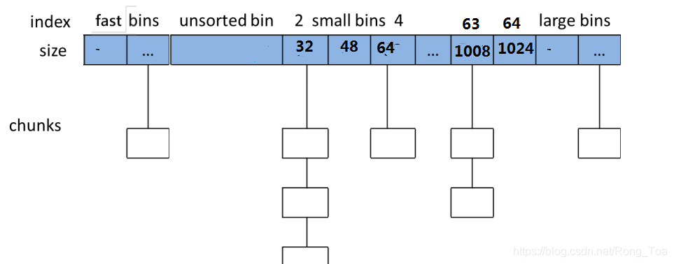


### 2.2.2. Chunk说明

一个 arena 中最顶部的 chunk 被称为「`top chunk`」。它不属于任何 bin 。当所有 bin 中都没有合适空闲内存时，就会使用 top chunk 来响应用户请求。
当 top chunk 的大小比用户请求的大小小的时候，top chunk 就通过 sbrk（main arena）或 mmap（ thread arena）系统调用扩容。

「`last remainder chunk`」即最后一次 small request 中因分割而得到的剩余部分，它有利于改进引用局部性，也即后续对 small chunk 的 malloc 请求可能最终被分配得彼此靠近。
当用户请求 small chunk 而无法从 small bin 和 unsorted bin 得到服务时，分配器就会通过扫描 binmaps 找到最小非空 bin。
正如前文所提及的，如果这样的 bin 找到了，其中最合适的 chunk 就会分割为两部分：返回给用户的 User chunk 、添加到 unsorted bin 中的 Remainder chunk。这一 Remainder chunk 就将成为 last remainder chunk。当用户的后续请求 small chunk，并且 last remainder chunk 是 unsorted bin 中唯一的 chunk，该 last remainder chunk 就将分割成两部分：返回给用户的 User chunk、添加到 unsorted bin 中的 Remainder chunk（也是 last remainder chunk）。因此后续的请求的 chunk 最终将被分配得彼此靠近。

**存在的问题**

* 如果后分配的内存先释放，无法及时归还系统。因为 ptmalloc 收缩内存是从 top chunk 开始,如果与 top chunk 相邻的 chunk 不能释放, top chunk 以下的 chunk 都无法释放。
* 内存不能在线程间移动，多线程使用内存不均衡将导致内存浪费
* 每个chunk至少8字节的开销很大
* 不定期分配长生命周期的内存容易造成内存碎片，不利于回收。
* 加锁耗时，无论当前分区有无耗时，在内存分配和释放时，会首先加锁，在多核多线程情况下，对主分配区竞争激烈，严重影响性能。

从上述来看**ptmalloc的主要问题其实是内存浪费、内存碎片、以及加锁导致的性能问题**。

备注：glibc 2.26( 2017-08-02 )中已经添加了tcache(thread local cache)优化malloc速度

## 2.3. __libc_malloc（glibc 2.32）


## 2.4. 主分配去与非主分配区

内存分配器中，为了解决多线程竞争锁的问题，分为主分配去main_area和非主分配区no_main_area。

1. 主分配区和非主分配区形成一个链表进行管理。
2. 每个分配区利用互斥锁使线程对于该分配区的访问互斥。
3. 每个进程只有一个主分配区，允许多个非主分配区。
4. ptmalloc根据系统对分配区的争用动态增加分配区的大小，分配区的数量一旦增加，则不会减少。
5. 主分配区可以使用brk和mmap来分配，非主分配区只能用mmap来映射。
6. 申请小内存是会产生很多内存碎片，ptmalloc在整理时也要对分配区做加锁操作。

当一个线程需要malloc分配内存：

1. 先查看该线程私有变量中是否已经存在一个分配区；
2. 若存在，尝试加锁；
3. 若加锁成功，使用该分配区分配内存；
4. 若失败，遍历循环链表，获取一个未加锁的分配区；
5. 若没找到未加锁分配区，开辟新的分配区，加入全局链表并加锁，然后分配内存；

当free释放内存：

1. 先获取待释放内存块所在的分配区的锁；
2. 若有其他线程持有该锁，必须等待其他线程释放该分配区互斥锁；


# 3. jemalloc(FackBook,FreeBSD,FireFox)

jemalloc是facebook推出的，目前在`firefox`、`facebook`服务器、`android 5.0 `等服务中大量使用。 jemalloc最大的优势还是其强大的多核/多线程分配能力. 
**以现代计算机硬件架构来说, 最大的瓶颈已经不再是内存容量或cpu速度, 而是多核/多线程下的lock contention(锁竞争).** 因为无论CPU核心数量如何多, 通常情况下内存只有一份. 可以说, 如果内存足够大, CPU的核心数量越多, 程序线程数越多, jemalloc的分配速度越快。

jemalloc是通用的malloc（3）实现，它强调避免碎片和可扩展的并发支持。jemalloc于2005年首次作为`FreeBSD libc`分配器使用，从那时起，它便进入了许多依赖其可预测行为的应用程序。2010年，jemalloc的开发工作扩大到包括开发人员支持功能，例如堆分析和大量的监视/调整挂钩。现代的jemalloc版本继续被集成回FreeBSD中，因此多功能性仍然至关重要。正在进行的开发工作趋向于使jemalloc成为各种要求苛刻的应用程序的最佳分配器，并消除/减轻对实际应用程序有实际影响的弱点。

## 3.1. 系统层面
对于一个多线程+多CPU核心的运行环境, 传统分配器中大量开销被浪费在`lock contention`和`false sharing`上, 随着线程数量和核心数量增多, 这种分配压力将越来越大.**针对多线程, 一种解决方法是将一把global lock分散成很多与线程相关的lock.** 而针对多核心, 则要尽量把不同线程下分配的内存隔离开, 避免不同线程使用同一个cache-line的情况.按照上面的思路, 一个较好的实现方式就是引入arena.将内存划分成若干数量的arenas, 线程最终会与某一个arena绑定.由于两个arena在地址空间上几乎不存在任何联系, 就可以在无锁的状态下完成分配. 同样由于空间不连续, 落到同一个cache-line中的几率也很小, 保证了各自独立。由于arena的数量有限, 因此**不能保证所有线程都能独占arena**, 分享同一个arena的所有线程, 由该arena内部的lock保持同步.

### 3.1.1. struct arena_s

```c
struct arena_s {
	/*
	 * Number of threads currently assigned to this arena.  Each thread has
	 * two distinct assignments, one for application-serving allocation, and
	 * the other for internal metadata allocation.  Internal metadata must
	 * not be allocated from arenas explicitly created via the arenas.create
	 * mallctl, because the arena.<i>.reset mallctl indiscriminately
	 * discards all allocations for the affected arena.
	 *
	 *   0: Application allocation.
	 *   1: Internal metadata allocation.
	 *
	 * Synchronization: atomic.
	 */
	atomic_u_t		nthreads[2];
	/* Next bin shard for binding new threads. Synchronization: atomic. */
	atomic_u_t		binshard_next;/* 绑定的新线程的下一个bin 碎片 */
	/*
	 * When percpu_arena is enabled, to amortize the cost of reading /
	 * updating the current CPU id, track the most recent thread accessing
	 * this arena, and only read CPU if there is a mismatch.
	 */
	tsdn_t		*last_thd;/* 用于跟踪上一次使用的CPU */
	/* Synchronization: internal. */
	arena_stats_t		stats;/* arena统计信息 */
	/*
	 * Lists of tcaches and cache_bin_array_descriptors for extant threads
	 * associated with this arena.  Stats from these are merged
	 * incrementally, and at exit if opt_stats_print is enabled.
	 *
	 * Synchronization: tcache_ql_mtx.
	 */
	ql_head(tcache_slow_t)			tcache_ql;/* tcache指针 */
	ql_head(cache_bin_array_descriptor_t)	cache_bin_array_descriptor_ql;/* cache bin array描述符指针 */
	malloc_mutex_t				tcache_ql_mtx;/* 锁 */
	/*
	 * Represents a dss_prec_t, but atomically.
	 *
	 * Synchronization: atomic.
	 */
	atomic_u_t		dss_prec;
	/*
	 * Extant large allocations.
	 *
	 * Synchronization: large_mtx.
	 */
	edata_list_active_t	large;/* 现存的大块分配内存 */
	/* Synchronizes all large allocation/update/deallocation. */
	malloc_mutex_t		large_mtx;/* 大块内存的锁 */
	/* The page-level allocator shard this arena uses. */
	pa_shard_t		pa_shard;/* 页级别分配器碎片 */
	/*
	 * bins is used to store heaps of free regions.
	 *
	 * Synchronization: internal.
	 */
	bins_t			bins[SC_NBINS];/* 存放堆的free regions */
	/*
	 * Base allocator, from which arena metadata are allocated.
	 *
	 * Synchronization: internal.
	 */
	base_t			*base;/* base 分配器 */
	/* Used to determine uptime.  Read-only after initialization. */
	nstime_t		create_time;/* 创建时间 */
};
```
【目前jemalloc 5.2.1中已经找不到chunk结构了】
chunk是仅次于arena的次级内存结构，arena都有专属的chunks, 每个chunk的头部都记录了chunk的分配信息。chunk是具体进行内存分配的区域，目前的默认大小是4M。chunk以page（默认为4K)为单位进行管理，每个chunk的前几个page（默认是6个）用于存储chunk的元数据，后面跟着一个或多个page的runs。后面的runs可以是未分配区域， 多个小对象组合在一起组成run, 其元数据放在run的头部。 大对象构成的run, 其元数据放在chunk的头部。在使用某一个chunk的时候，会把它分割成很多个run，并记录到bin中。不同size的class对应着不同的bin，在bin里，都会有一个红黑树来维护空闲的run，并且在run里，使用了bitmap来记录了分配状态。此外，每个arena里面维护一组按地址排列的可获得的run的红黑树。

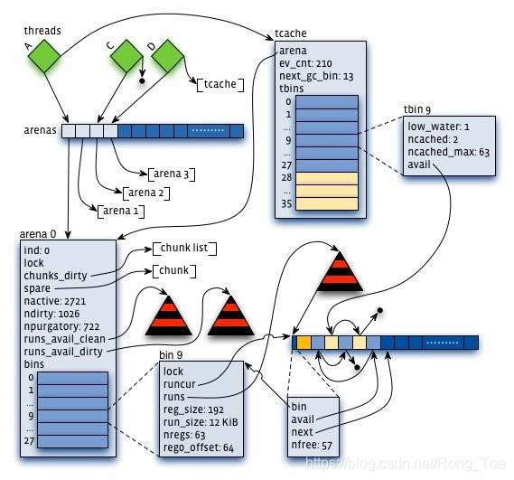


## 3.2. 用户层面

jemalloc 按照内存分配请求的尺寸，分了 small object (例如 1 – 57344B)、 large object (例如 57345 – 4MB )、 huge object (例如 4MB以上)。jemalloc同样有一层线程缓存的内存名字叫tcache，当分配的内存大小小于tcache_maxclass时，jemalloc会首先在tcache的small object以及large object中查找分配，tcache不中则从arena中申请run，并将剩余的区域缓存到tcache。若arena找不到合适大小的内存块， 则向系统申请内存。当申请大小大于tcache_maxclass且大小小于huge大小的内存块时，则直接从arena开始分配。而huge object的内存不归arena管理， 直接采用mmap从system memory中申请，并由一棵与arena独立的红黑树进行管理。
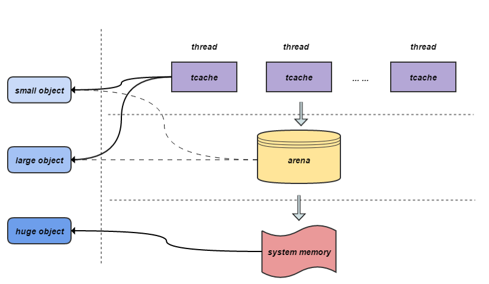

## 3.3. jemalloc的优势
多线程下加锁大大减少


# 4. tcmalloc(Google,Golang)

**由于网上介绍的版本与代码版本找不到匹配关系，甚至介绍版本是C语言开发，网上下载的代码为C++开发，此处不做详细的源码讲解，只做结构性介绍。**

tcmalloc是Google开发的内存分配器，在Golang、Chrome中都有使用该分配器进行内存分配。有效的优化了ptmalloc中存在的问题。当然为此也付出了一些代价，按下表，先看tcmalloc的具体实现。

## 4.1. 系统层面

tcmalloc把`4kb`的连续内存称为一个页(`Page`)，可以用下面两个常量来描述：
```c
inline constexpr size_t kPageShift = 12;
inline constexpr size_t kPageSize = 1 << kPageShift;
```
对于一个指针p，`p>>kPageShift`即是p的页地址。

```c
// Information kept for a span (a contiguous run of pages). 
struct Span { 
    PageID start; // Starting page number 
    Length length; // Number of pages in span 
    Span* next; // Used when in link list 
    Span* prev; // Used when in link list 
    union { 
        void* objects; // Linked list of free objects 
        // Span may contain iterator pointing back at SpanSet entry of 
        // this span into set of large spans. It is used to quickly delete 
        // spans from those sets. span_iter_space is space for such 
        // iterator which lifetime is controlled explicitly. 
        char span_iter_space[sizeof(SpanSet::iterator)]; 
    }; 
    unsigned int refcount : 16; // Number of non-free objects 
    unsigned int sizeclass : 8; // Size-class for small objects (or 0) 
    unsigned int location : 2; // Is the span on a freelist, and if so, which? 
    unsigned int sample : 1; // Sampled object? 
    bool has_span_iter : 1; // If span_iter_space has valid 
    // iterator. Only for debug builds. 
    // What freelist the span is on: IN_USE if on none, or normal or returned 
    enum { 
        IN_USE, 
        ON_NORMAL_FREELIST, 
        ON_RETURNED_FREELIST 
    }; 
}; // We segregate spans of a given size into two circular linked 
// lists: one for normal spans, and one for spans whose memory 
// has been returned to the system. 
struct SpanList { 
    Span normal; 
    Span returned; 
}; 
// Array mapping from span length to a doubly linked list of free spans 
// 
// NOTE: index 'i' stores spans of length 'i + 1'. SpanList free_[kMaxPages]; 
// Sets of spans with length > kMaxPages. 
// 
// Rather than using a linked list, we use sets here for efficient 
// best-fit search. 
SpanSet large_normal_; 
SpanSet large_returned_;
```


## 4.2. 用户层面

TCMalloc是专门对多线并发的内存管理而设计的，TCMalloc主要是在线程级实现了缓存，使得用户在申请内存时大多情况下是无锁内存分配。

**从用户角度看tcmalloc架构**

整个tcmalloc实现了三级缓存，分别是：

1. ThreadCache – 线程级别缓存；
2. CentralCache - 中央缓存CentralFreeList；（需要加锁访问）
3. PageHeap – 页缓存；（需要加锁访问）


**Tcmalloc分配内存的流程**：

1. 每个线程都有一个线程局部ThreadCache，ThreadCache中包含一个链表数据组FreeList list_[kNumClasses]，维护了不同规格的空闲内存的规则的内存。
2. 如果ThreadCache对象不够了，就从CentralCache中批量分配；
3. 如果CentralCache依然不够，就从PageHeap中申请Span；
4. PageHeap首先从free[n,128]中查找，然后到large set中查找，目标是为了找到一个最小满足要求的空闲Span，优先使用normal类链表中的Span。
5. 如果找到了一个Span，则尝试分裂（Carve）这个Span并分配出去；如果所有的链表中都没找到length>=n的Span，则只能从操作系统中申请了。
6. Tcmalloc一次最少向OS申请1MB内存，默认情况下使用是sbrk()，sbrk()失败后使用mmap()。


# 5. 三种分配器的对比测试

内存分配无非需要的是malloc和free的性能，版本信息如下：

* ptmalloc（`glibc-2.25.1-31.base.el7`）
* jemalloc（`5.2.1-586-g92e189be8b725be1f4de5f476f410173db29bc7d`）
* tcmalloc（`gperftools 2.0`）

横坐标申请内存块大小`malloc()`入参，纵坐标为时间[MicroSecond]，分别进行循环往复200000次的malloc-free运算求和。

## 5.1. 虚拟机

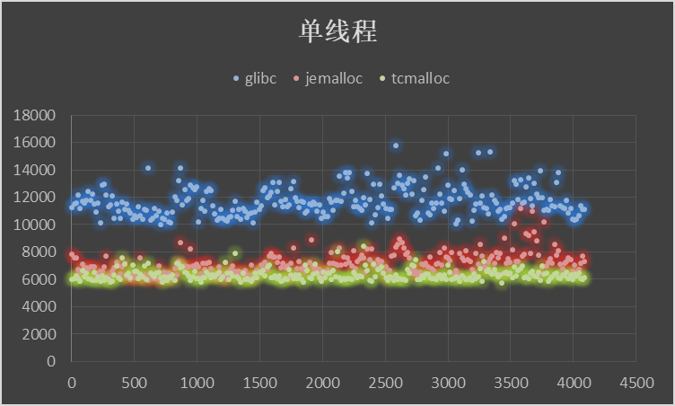

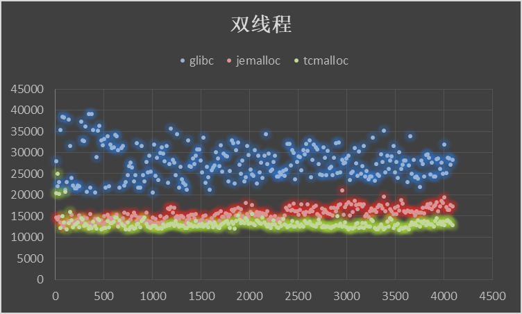


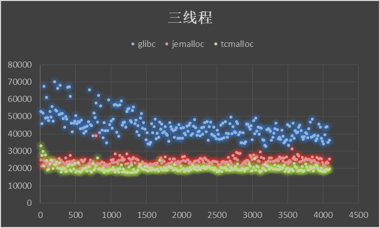

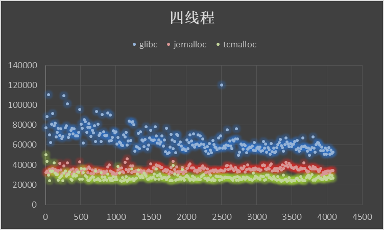

## 5.2. 服务器
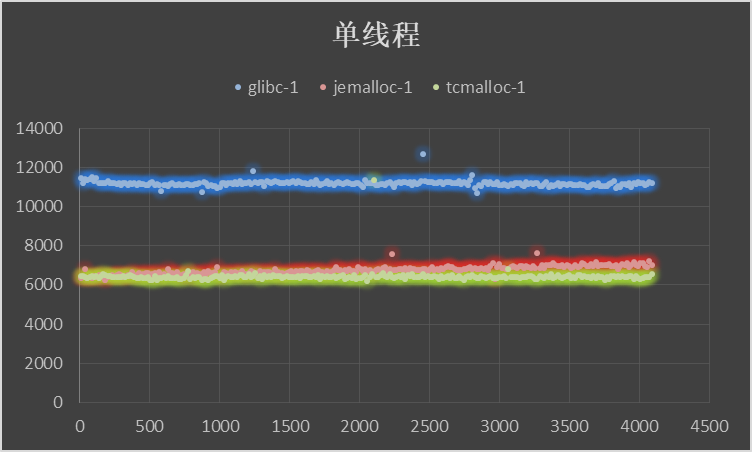

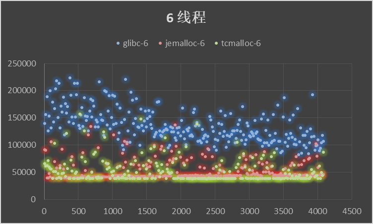


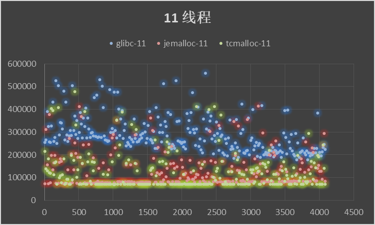

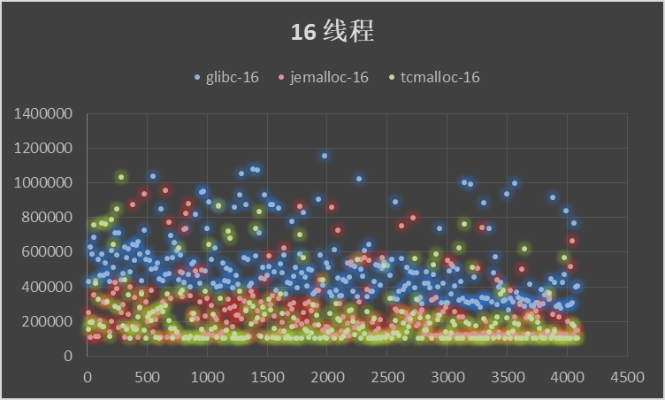


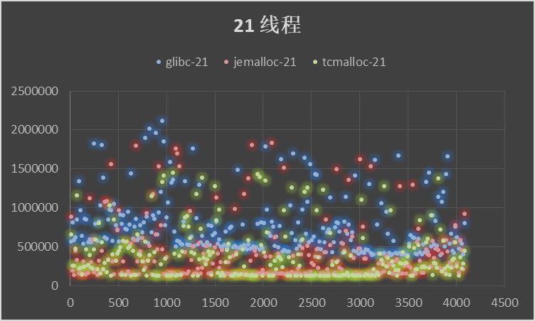


# 6. 总结

* 作为基础库的ptmalloc是最为稳定的内存管理器，无论在什么环境下都能适应，但是分配效率相对较低。
* tcmalloc针对多核情况有所优化，性能有所提高，但是内存占用稍高，大内存分配容易出现CPU飙升。
* jemalloc的内存占用更高，但是在多核多线程下的表现也最为优异。

在什么情况下我们应该考虑好内存分配如何管理：

* 多核多线程的情况下，内存管理需要考虑：**内存分配加锁、异步内存释放、多线程之间的内存共享、线程的生命周期**；
* 内存当作磁盘使用的情况下，需要考虑内存分配和释放的效率，是使用内存管理库还是应该自己进行大对象大内存的管理（在搜索以及推荐系统中尤为突出）。


# 7. 参考文章

* 《jemalloc简介》
* 《图解tcmalloc内存分配器》
* 《TCMalloc：线程缓存Malloc以及tcmalloc与ptmalloc性能对比》
* 《ptmalloc、tcmalloc与jemalloc内存分配器对比分析》
* 《使用jemalloc在Go中进行手动内存管理》
* 《理解 glibc malloc：主流用户态内存分配器实现原理》
* 《Glibc 内存管理 Ptmalloc2 源代码分析》
* 《TCMalloc分析 - 如何减少内存碎片》
* 《TCMalloc分析笔记(gperftools-2.4)》
* 《jemalloc源码解析-内存管理》

# 8. 参考链接

* http://mqzhuang.iteye.com/blog/1005909
* https://paper.seebug.org/papers/Archive/refs/heap/glibc%E5%86%85%E5%AD%98%E7%AE%A1%E7%90%86ptmalloc%E6%BA%90%E4%BB%A3%E7%A0%81%E5%88%86%E6%9E%90.pdf
* http://core-analyzer.sourceforge.net/index_files/Page335.html
* https://blog.csdn.net/maokelong95/article/details/51989081
* https://zhuanlan.zhihu.com/p/29216091
* https://zhuanlan.zhihu.com/p/29415507
* https://blog.csdn.net/zwleagle/article/details/45113303
* http://game.academy.163.com/library/2015/2/10/17713_497699.html
* https://www.cnblogs.com/taoxinrui/p/6492733.html
* https://blog.csdn.net/vector03/article/details/50634802
* http://brionas.github.io/2015/01/31/jemalloc%E6%BA%90%E7%A0%81%E8%A7%A3%E6%9E%90-%E5%86%85%E5%AD%98%E7%AE%A1%E7%90%86/

<br/>
<div align=right>Rong Tao
</div>